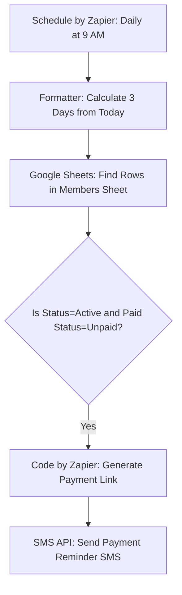
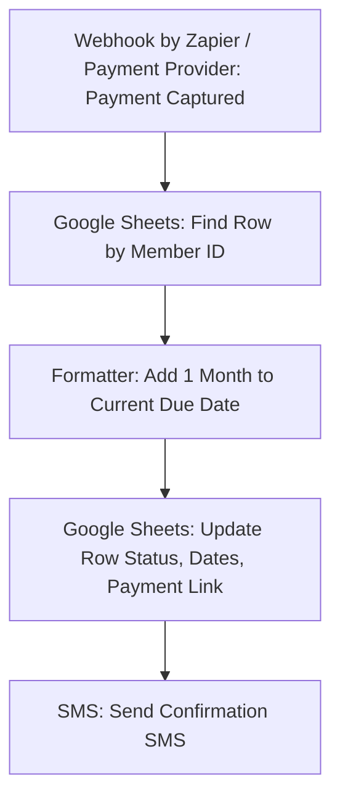
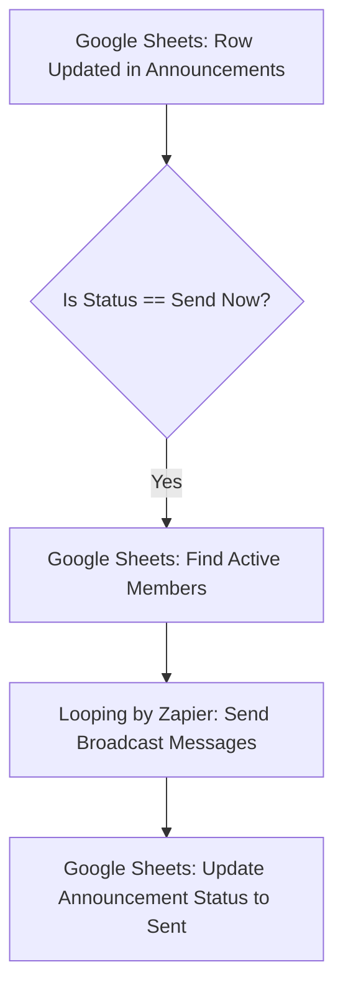

# Setup Guide: Gabbar Gym Zapier Automation (SMS Integration)

This guide walks you through configuring **Zapier**, **Google Sheets**, **Razorpay/Stripe**, and **SMS (via Twilio/Plivo/Zapier SMS)** to deploy the Gabbar Gym AI automation system.

---

## 📋 Table of Contents
1. [Google Sheets Configuration](#1-google-sheets-configuration)
2. [Zapier Workflow Configurations](#2-zapier-workflow-configurations)
   - [Zap 1: Daily Fee Reminders](#zap-1-daily-fee-reminders)
   - [Zap 2: Payment Receipt & Updates](#zap-2-payment-receipt--updates)
   - [Zap 3: Broadcasting Updates & Holidays](#zap-3-broadcasting-updates--holidays)
3. [SMS Service Setup Details](#3-sms-service-setup-details)
4. [Local Verification Script Setup](#4-local-verification-script-setup)

---

## 1. Google Sheets Configuration

1. Create a new Google Spreadsheet and name it **Gabbar Gym Automation**.
2. Create two worksheets (tabs):
   - **Members**
   - **Announcements**
3. Copy the headers from the templates created in your workspace:
   - For **Members**, import or copy the header row from [members_template.csv](file:///c:/Users/Sai%20Kumar/Desktop/gabbar%20gym/members_template.csv).
   - For **Announcements**, import or copy the header row from [announcements_template.csv](file:///c:/Users/Sai%20Kumar/Desktop/gabbar%20gym/announcements_template.csv).
4. **Formatting Column Date:** Ensure the `Due Date` and `Last Paid Date` columns are formatted as plain text or standard Date (`YYYY-MM-DD`).

---

## 2. Zapier Workflow Configurations

Create an account at [Zapier.com](https://zapier.com) and set up the following three Zaps:

### Zap 1: Daily Fee Reminders

This Zap triggers daily to check for memberships due in 3 days.



#### Step Details:
1. **Trigger:** `Schedule by Zapier`
   - **Event:** Every Day
   - **Time of Day:** `9am` (or preferred time)
2. **Action:** `Formatter by Zapier (Date/Time)`
   - **Transform:** `Add/Subtract Time`
   - **Input:** `{{zap_meta_human_now}}` (Today)
   - **Expression:** `+3 days`
   - **To Format:** `YYYY-MM-DD`
   - This value will represent the target `Due Date` to filter.
3. **Action:** `Google Sheets (Find Multiple Rows)`
   - **Spreadsheet:** `Gabbar Gym Automation`
   - **Worksheet:** `Members`
   - **Lookup Column:** `Due Date`
   - **Lookup Value:** Output from Step 2 (Date in 3 days)
4. **Action:** `Looping by Zapier (Create Loop from Line Items)`
   - Feed the Name, Phone Number, Member ID, and Fee Amount arrays from the Google Sheets search.
5. **Action:** `Code by Zapier (Python)` *(Optional - to generate dynamic Razorpay Payment Links)*
   - Add the Python code snippet from `scripts/generate_links.py` to create a link.
   - Set up the environment variables: `KEY_ID` and `KEY_SECRET`.
   - Pass input data: `amount`, `name`, `phone`, `member_id`.
   - Map output: `payment_link`.
6. **Action:** `Twilio` (or `Plivo` / `SMS by Zapier`)
   - **To Phone Number:** `{{loop_Phone_Number}}`
   - **Message Text:**
     > "Hi {{Name}}, friendly reminder from Gabbar Gym. Your membership fee of Rs. {{Fee Amount}} is due on {{Due Date}}. Pay online here: {{Payment Link}}. If already paid, please ignore."

---

### Zap 2: Payment Receipt & Updates

This Zap triggers immediately when a payment succeeds.



#### Step Details:
1. **Trigger:** `Razorpay` or `Stripe` or `Webhooks by Zapier`
   - **Event:** `Payment Link Paid` or custom webhook payload.
2. **Action:** `Google Sheets (Find Row)`
   - **Spreadsheet:** `Gabbar Gym Automation`
   - **Worksheet:** `Members`
   - **Lookup Column:** `Member ID` (Extracted from metadata/notes of payment trigger)
   - **Lookup Value:** `{{Trigger.Metadata.MemberID}}`
3. **Action:** `Formatter by Zapier (Date/Time)`
   - **Transform:** `Add/Subtract Time`
   - **Input:** `{{Google_Sheet_Row.Due_Date}}`
   - **Expression:** `+1 month`
   - **To Format:** `YYYY-MM-DD`
4. **Action:** `Google Sheets (Update Row)`
   - **Row:** Use ID from Step 2.
   - **Update Values:**
     - `Payment Status` = `Paid`
     - `Last Paid Date` = Today (`{{zap_meta_human_now}}`)
     - `Due Date` = Output from Step 3 (Date extended by 1 month)
     - `Payment Link` = *leave blank* (clears payment link)
5. **Action:** `Twilio` (or `Plivo` / `SMS by Zapier`)
   - **To:** `{{Google_Sheet_Row.Phone_Number}}`
   - **Message:**
     > "Thank you {{Name}}! We received your fee of Rs. {{Fee Amount}}. Your Gabbar Gym membership has been renewed until {{New Due Date}}. Keep training!"

---

### Zap 3: Broadcasting Updates & Holidays

This Zap broadcasts gym notices to all active members when a new announcement row is updated.



#### Step Details:
1. **Trigger:** `Google Sheets (New or Updated Spreadsheet Row)`
   - **Spreadsheet:** `Gabbar Gym Automation`
   - **Worksheet:** `Announcements`
   - **Trigger Column:** `Status`
2. **Filter by Zapier:**
   - Only continue if `Status` **exactly matches** `Send Now`.
3. **Action:** `Google Sheets (Find Multiple Rows)`
   - **Worksheet:** `Members`
   - **Lookup Column:** `Status`
   - **Lookup Value:** `Active`
4. **Action:** `Looping by Zapier (Create Loop from Line Items)`
   - Feed the names and phone numbers of the active members.
5. **Action:** `Twilio` (or `Plivo` / `SMS by Zapier`)
   - Send the custom `{{Message}}` from Step 1 trigger to each user's `{{Phone_Number}}`.
6. **Action:** `Google Sheets (Update Row)`
   - **Row:** Trigger Announcement Row.
   - Set `Status` = `Sent` to prevent duplicate sends.

---

## 3. SMS Service Setup Details

To connect SMS to Zapier, you have three primary options:

| Service Provider | Setup Difficulty | Pros & Cons |
| :--- | :--- | :--- |
| **SMS by Zapier** | Very Easy | **Pro:** Native, fast to configure. **Con:** Restricted to certain countries and limits per hour. |
| **Twilio SMS** | Easy | **Pro:** Worldwide coverage, cheap rates, highly reliable. **Con:** Requires renting a phone number/Sender ID. |
| **Plivo** | Easy | **Pro:** Excellent rates for India & international bulk SMS. **Con:** Verification needed for commercial IDs. |
| **Razorpay Direct SMS** | Zero-Code | **Pro:** Razorpay can send fee links directly via SMS automatically. **Con:** Uncustomizable SMS templates. |

---

## 4. Local Verification Script Setup

You can test the system logic (finding members and updating CSV records) using the mock scripts. Refer to the project README or run the verify script in terminal:
```bash
python scripts/mock_webhook_server.py
```
Send a mock JSON payload to `http://localhost:8000` to simulate a payment trigger and observe the changes in `members_template.csv`!
